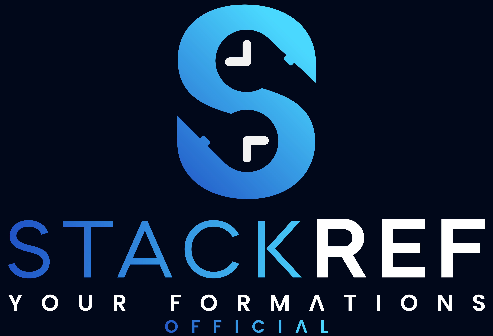
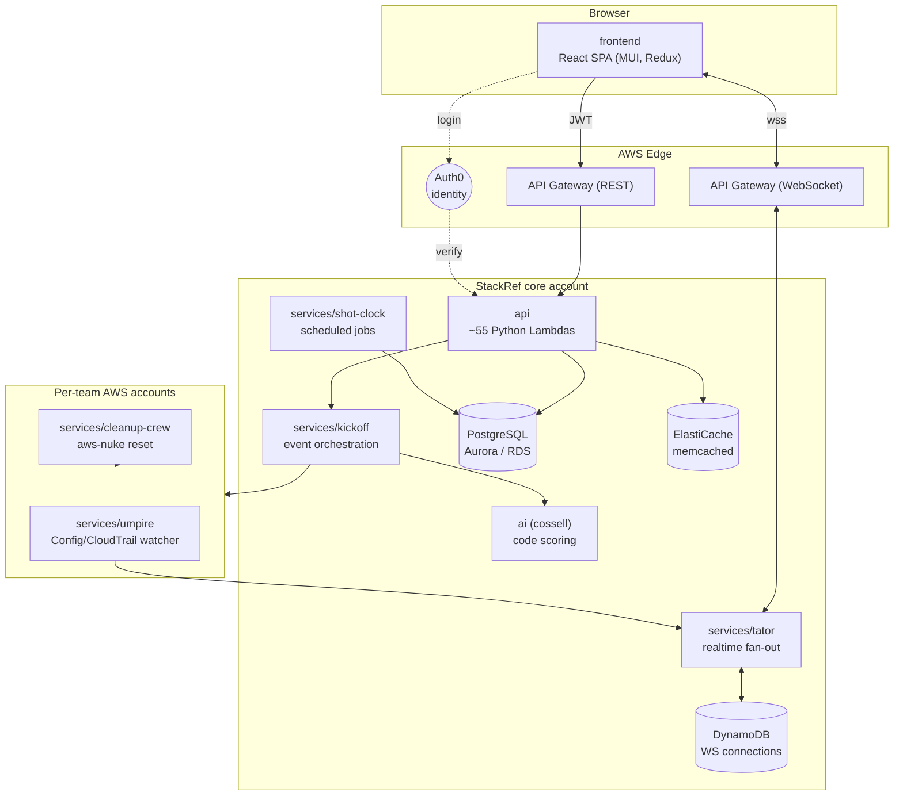

<div align="center">



# StackRef Hackathon Manager (StackRef HM)

**An end-to-end platform for running cloud hackathons on real, sandboxed AWS accounts —
with live monitoring, automated scoring, judging, and team management.**

[](LICENSE)
-orange.svg)


</div>

---

## What is this?

StackRef HM was a commercial SaaS product for organizing and running **cloud
hackathons**. Unlike a typical hackathon tool, StackRef gives every participating
team its own **real, isolated AWS account** to build in. The platform then:

- provisions and tears down those team accounts automatically,
- watches what teams do in their accounts in **real time** (via CloudTrail / AWS Config),
- runs **automated code scans and AI-assisted scoring** on team work,
- supports **human judging** against configurable criteria,
- and handles the surrounding event machinery: organizations, participants, teams,
  invitations, kanban boards, a "coin bank"/rewards economy, a resource marketplace,
  calendars, and billing.

It is now **open-sourced as-is** under the Apache-2.0 license. This is a large,
real-world system extracted from production; see [Status & expectations](#status--expectations).

> **Heads up:** This repository is a *reference implementation*. It was sanitized from a
> live, multi-account AWS Organizations deployment. Account IDs, domains, and credentials
> have been replaced with placeholders. You will need to supply your own. See
> [`docs/SANITIZATION.md`](docs/SANITIZATION.md).

## Architecture at a glance



For the full data flow, the multi-account model, and how a hackathon event progresses
from creation to teardown, read [`docs/architecture.md`](docs/architecture.md).

## Component map

| Directory | Codename | What it does | Stack |
|---|---|---|---|
| [`frontend/`](frontend/) | — | The web app: organizer + participant UI | React 18, MUI, Redux Toolkit, Auth0 |
| [`api/`](api/) | — | REST API — ~55 single-purpose Lambda functions + API Gateway | Python 3.11, PostgreSQL, ElastiCache |
| [`database/`](database/) | — | The core relational schema (numbered DDL migrations) | PostgreSQL |
| [`services/tator/`](services/tator/) | *spec**tator*** | Real-time WebSocket fan-out to the UI | Python, API Gateway WS, DynamoDB, SQS |
| [`services/kickoff/`](services/kickoff/) | *kickoff* | Starts events: forms teams, kanban, code scans | Python, SQS, Lambda |
| [`services/shot-clock/`](services/shot-clock/) | *shot-clock* | Scheduled jobs: marketplace metering, invitations | Python, EventBridge |
| [`services/umpire/`](services/umpire/) | *umpire* (referee) | Watches team accounts via Config + CloudTrail | Python, AWS Config |
| [`services/cleanup-crew/`](services/cleanup-crew/) | *cleanup-crew* | Resets team accounts between events | Docker, `aws-nuke` |
| [`ai/`](ai/) | *cossell* | AI scoring of team code (security, smells, complexity) | Python, LangChain, Anthropic/OpenAI |
| [`auth0/`](auth0/) | — | Auth0 tenant: login page, actions, Terraform | Auth0, Terraform |
| [`infra/`](infra/) | — | Org-level infra: AWS Organizations, VPC/RDS, GitLab, GCP, Stripe | Terraform |

## Repository layout

```
stackref-hm/
├── frontend/            React single-page app
├── api/                 REST API Lambdas + API Gateway Terraform
├── database/            PostgreSQL DDL (applied in numeric order)
├── services/
│   ├── tator/           Real-time WebSocket service
│   ├── kickoff/         Event start orchestration
│   ├── shot-clock/      Scheduled jobs
│   ├── umpire/          Team-account monitoring
│   └── cleanup-crew/    Team-account reset (aws-nuke)
├── ai/                  AI code-scoring service (cossell)
├── auth0/               Auth0 tenant configuration
├── infra/               AWS Organizations + supporting infrastructure
├── docs/                Architecture, deployment, sanitization
└── scripts/             Tooling used to build & sanitize this public tree
```

## Prerequisites

To stand up a full StackRef HM you will need:

- An **AWS Organizations** setup (the platform provisions per-team member accounts).
- A **PostgreSQL** database (the production deployment used Aurora PostgreSQL).
- An **Auth0** tenant for authentication.
- **Terraform** ≥ 1.5 and the AWS CLI, configured for your accounts.
- **Node.js** ≥ 18 (frontend) and **Python 3.11** (services).
- Optional integrations: **Stripe** (billing), **Sentry** (errors), **MUI X Pro**
  license (date/range pickers), **Anthropic/OpenAI** keys (AI scoring), Amazon
  Marketplace (SaaS metering), Zoom (in-app video).

You do **not** need all of these to explore or to run individual components locally —
each component's README explains its own minimal setup.

## Quick start

Each component is independently runnable. The fastest thing to see is the frontend:

```bash
cd frontend
cp .env.example .env.local      # fill in your Auth0 + API values
npm install
npm start                       # http://localhost:9003
```

To bring up the backend you apply the database schema, deploy the API Lambdas, then
the supporting services. The recommended end-to-end order is documented in
[`docs/deployment.md`](docs/deployment.md).

## Status & expectations

- **Source-available, as-is.** This was production SaaS code. It is provided for
  learning, reuse, and self-hosting — not as a turnkey, one-command install.
- **Configuration is yours.** All deployment-specific values (AWS account IDs,
  domains, credentials, Auth0 IDs) were replaced with placeholders. Look for
  `*.example` files and `YOUR_...`/`example.com`/`000000000000` placeholders.
- **The `infra/` Terraform is a reference, not a button.** It models a specific
  multi-account AWS Organizations deployment. Read it before you `apply`.
- **No warranty.** See [LICENSE](LICENSE).

## Security & sanitization

This public tree was mechanically produced from the original private repositories.
Git history, Terraform state, real `.env`/`.tfvars`, vendored dependencies, and key
material were excluded; identifying values were replaced with placeholders. The exact
process is documented and reproducible — see [`docs/SANITIZATION.md`](docs/SANITIZATION.md)
and [`scripts/`](scripts/). If you believe something sensitive slipped through, please
open a private security report rather than a public issue.

## Contributing

See [CONTRIBUTING.md](CONTRIBUTING.md). The cardinal rule: **never commit secrets.**

## Authors

StackRef HM was created by Keith McDuffee. See [AUTHORS](AUTHORS).

## License

Apache License 2.0 — see [LICENSE](LICENSE) and [NOTICE](NOTICE).
