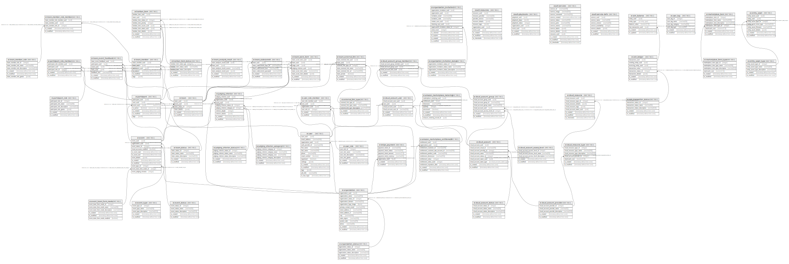

# sr

## Tables

| Name | Columns | Comment | Type |
| ---- | ------- | ------- | ---- |
| [sr.organization_status](sr.organization_status.md) | 5 |  | BASE TABLE |
| [sr.organization](sr.organization.md) | 14 |  | BASE TABLE |
| [sr.organization_invitation_status](sr.organization_invitation_status.md) | 5 |  | BASE TABLE |
| [sr.organization_invitation](sr.organization_invitation.md) | 12 |  | BASE TABLE |
| [sr.user](sr.user.md) | 15 |  | BASE TABLE |
| [sr.user_role](sr.user_role.md) | 6 |  | BASE TABLE |
| [sr.user_role_member](sr.user_role_member.md) | 6 |  | BASE TABLE |
| [coach.resources](coach.resources.md) | 10 |  | BASE TABLE |
| [coach.playbooks](coach.playbooks.md) | 7 |  | BASE TABLE |
| [coach.services](coach.services.md) | 13 |  | BASE TABLE |
| [coach.service-defs](coach.service-defs.md) | 7 |  | BASE TABLE |
| [sr.event_status](sr.event_status.md) | 5 |  | BASE TABLE |
| [sr.event_type](sr.event_type.md) | 5 |  | BASE TABLE |
| [sr.event_team_form_mode](sr.event_team_form_mode.md) | 6 |  | BASE TABLE |
| [sr.event](sr.event.md) | 12 |  | BASE TABLE |
| [sr.participant](sr.participant.md) | 7 |  | BASE TABLE |
| [sr.participant_role](sr.participant_role.md) | 6 |  | BASE TABLE |
| [sr.participant_role_member](sr.participant_role_member.md) | 5 |  | BASE TABLE |
| [sr.team_status](sr.team_status.md) | 5 |  | BASE TABLE |
| [sr.team](sr.team.md) | 6 |  | BASE TABLE |
| [sr.team_member](sr.team_member.md) | 6 |  | BASE TABLE |
| [sr.team_member_role](sr.team_member_role.md) | 6 |  | BASE TABLE |
| [sr.team_member_role_member](sr.team_member_role_member.md) | 5 |  | BASE TABLE |
| [sr.cloud_account_provider](sr.cloud_account_provider.md) | 5 |  | BASE TABLE |
| [sr.cloud_account_status](sr.cloud_account_status.md) | 5 |  | BASE TABLE |
| [sr.cloud_account](sr.cloud_account.md) | 9 |  | BASE TABLE |
| [sr.cloud_account_access_level](sr.cloud_account_access_level.md) | 5 |  | BASE TABLE |
| [sr.cloud_account_user](sr.cloud_account_user.md) | 6 |  | BASE TABLE |
| [sr.cloud_account_group](sr.cloud_account_group.md) | 7 |  | BASE TABLE |
| [sr.cloud_account_group_member](sr.cloud_account_group_member.md) | 5 |  | BASE TABLE |
| [sr.coin_transaction_status](sr.coin_transaction_status.md) | 5 |  | BASE TABLE |
| [sr.coin_ledger](sr.coin_ledger.md) | 8 |  | BASE TABLE |
| [sr.coin_balance](sr.coin_balance.md) | 6 |  | BASE TABLE |
| [sr.judging_criterion_status](sr.judging_criterion_status.md) | 5 |  | BASE TABLE |
| [sr.judging_criterion_category](sr.judging_criterion_category.md) | 6 |  | BASE TABLE |
| [sr.judging_criterion](sr.judging_criterion.md) | 9 |  | BASE TABLE |
| [sr.user_tag](sr.user_tag.md) | 6 |  | BASE TABLE |
| [sr.external_link_type](sr.external_link_type.md) | 5 |  | BASE TABLE |
| [sr.team_external_link](sr.team_external_link.md) | 8 |  | BASE TABLE |
| [sr.team_score_item](sr.team_score_item.md) | 8 |  | BASE TABLE |
| [sr.team_event_feedback](sr.team_event_feedback.md) | 7 |  | BASE TABLE |
| [sr.cloud_resource_type](sr.cloud_resource_type.md) | 7 |  | BASE TABLE |
| [sr.cloud_resource](sr.cloud_resource.md) | 8 |  | BASE TABLE |
| [sr.marketplace_item_type](sr.marketplace_item_type.md) | 6 |  | BASE TABLE |
| [sr.marketplace_item](sr.marketplace_item.md) | 7 |  | BASE TABLE |
| [sr.team_codecommit](sr.team_codecommit.md) | 6 |  | BASE TABLE |
| [sr.team_analysis_result](sr.team_analysis_result.md) | 6 |  | BASE TABLE |
| [sr.amazon_marketplace_entitlement](sr.amazon_marketplace_entitlement.md) | 11 |  | BASE TABLE |
| [sr.amazon_marketplace_metering](sr.amazon_marketplace_metering.md) | 8 |  | BASE TABLE |
| [sr.kanban_item_status](sr.kanban_item_status.md) | 5 |  | BASE TABLE |
| [sr.kanban_item](sr.kanban_item.md) | 9 |  | BASE TABLE |
| [sr.entity_asset_type](sr.entity_asset_type.md) | 5 |  | BASE TABLE |
| [sr.entity_asset](sr.entity_asset.md) | 8 |  | BASE TABLE |
| [sr.stripe_payment](sr.stripe_payment.md) | 7 |  | BASE TABLE |

## Stored procedures and functions

| Name | ReturnType | Arguments | Type |
| ---- | ------- | ------- | ---- |
| sr.uuid_nil | uuid |  | FUNCTION |
| sr.uuid_ns_dns | uuid |  | FUNCTION |
| sr.uuid_ns_url | uuid |  | FUNCTION |
| sr.uuid_ns_oid | uuid |  | FUNCTION |
| sr.uuid_ns_x500 | uuid |  | FUNCTION |
| sr.uuid_generate_v1 | uuid |  | FUNCTION |
| sr.uuid_generate_v1mc | uuid |  | FUNCTION |
| sr.uuid_generate_v3 | uuid | namespace uuid, name text | FUNCTION |
| sr.uuid_generate_v4 | uuid |  | FUNCTION |
| sr.uuid_generate_v5 | uuid | namespace uuid, name text | FUNCTION |
| sr.fn_bank_balance | float8 | entity_uuid uuid | FUNCTION |
| sr.fn_bank_transaction | json | new_transaction_uuid uuid, new_sending_entity_uuid uuid, new_receiving_entity_uuid uuid, new_transaction_value double precision, new_transaction_status_id bigint, new_transaction_details jsonb | FUNCTION |
| sr.fn_bank_transactions | json | entity_uuid uuid, num_transactions bigint DEFAULT 1000 | FUNCTION |
| sr.fn_eject_organization | uuid | ou uuid | FUNCTION |
| sr.fn_entity_type | text | entity_uuid uuid | FUNCTION |
| sr.fn_event_activity | json | p_event_uuid uuid, p_offset integer DEFAULT 0, p_limit integer DEFAULT 25 | FUNCTION |

## Relations

---

> Generated by [tbls](https://github.com/k1LoW/tbls)
