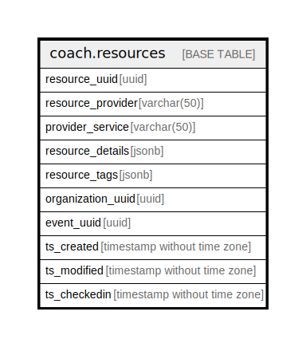

# coach.resources

## Description

## Columns

| Name | Type | Default | Nullable | Children | Parents | Comment |
| ---- | ---- | ------- | -------- | -------- | ------- | ------- |
| resource_uuid | uuid |  | false |  |  |  |
| resource_provider | varchar(50) |  | true |  |  |  |
| provider_service | varchar(50) |  | true |  |  |  |
| resource_details | jsonb |  | true |  |  |  |
| resource_tags | jsonb |  | true |  |  |  |
| organization_uuid | uuid |  | true |  |  |  |
| event_uuid | uuid |  | true |  |  |  |
| ts_created | timestamp without time zone | (now() AT TIME ZONE 'utc'::text) | true |  |  |  |
| ts_modified | timestamp without time zone | (now() AT TIME ZONE 'utc'::text) | true |  |  |  |
| ts_checkedin | timestamp without time zone |  | true |  |  |  |

## Constraints

| Name | Type | Definition |
| ---- | ---- | ---------- |
| resources_pk | PRIMARY KEY | PRIMARY KEY (resource_uuid) |

## Indexes

| Name | Definition |
| ---- | ---------- |
| resources_pk | CREATE UNIQUE INDEX resources_pk ON coach.resources USING btree (resource_uuid) |

## Relations

---

> Generated by [tbls](https://github.com/k1LoW/tbls)
