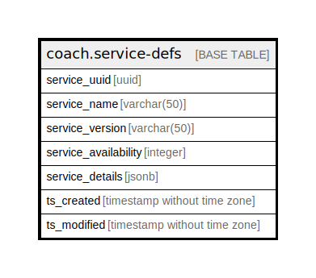

# coach.service-defs

## Description

## Columns

| Name | Type | Default | Nullable | Children | Parents | Comment |
| ---- | ---- | ------- | -------- | -------- | ------- | ------- |
| service_uuid | uuid |  | false |  |  |  |
| service_name | varchar(50) |  | true |  |  |  |
| service_version | varchar(50) |  | true |  |  |  |
| service_availability | integer |  | true |  |  |  |
| service_details | jsonb |  | true |  |  |  |
| ts_created | timestamp without time zone | (now() AT TIME ZONE 'utc'::text) | true |  |  |  |
| ts_modified | timestamp without time zone | (now() AT TIME ZONE 'utc'::text) | true |  |  |  |

## Constraints

| Name | Type | Definition |
| ---- | ---- | ---------- |
| service-defs_pkey | PRIMARY KEY | PRIMARY KEY (service_uuid) |

## Indexes

| Name | Definition |
| ---- | ---------- |
| service-defs_pkey | CREATE UNIQUE INDEX "service-defs_pkey" ON coach."service-defs" USING btree (service_uuid) |

## Relations

---

> Generated by [tbls](https://github.com/k1LoW/tbls)
