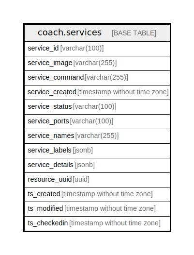

# coach.services

## Description

## Columns

| Name | Type | Default | Nullable | Children | Parents | Comment |
| ---- | ---- | ------- | -------- | -------- | ------- | ------- |
| service_id | varchar(100) |  | false |  |  |  |
| service_image | varchar(255) |  | true |  |  |  |
| service_command | varchar(255) |  | true |  |  |  |
| service_created | timestamp without time zone |  | true |  |  |  |
| service_status | varchar(100) |  | true |  |  |  |
| service_ports | varchar(100) |  | true |  |  |  |
| service_names | varchar(255) |  | true |  |  |  |
| service_labels | jsonb |  | true |  |  |  |
| service_details | jsonb |  | true |  |  |  |
| resource_uuid | uuid |  | true |  |  |  |
| ts_created | timestamp without time zone | (now() AT TIME ZONE 'utc'::text) | true |  |  |  |
| ts_modified | timestamp without time zone | (now() AT TIME ZONE 'utc'::text) | true |  |  |  |
| ts_checkedin | timestamp without time zone |  | true |  |  |  |

## Constraints

| Name | Type | Definition |
| ---- | ---- | ---------- |
| services_pkey | PRIMARY KEY | PRIMARY KEY (service_id) |

## Indexes

| Name | Definition |
| ---- | ---------- |
| services_pkey | CREATE UNIQUE INDEX services_pkey ON coach.services USING btree (service_id) |

## Relations

---

> Generated by [tbls](https://github.com/k1LoW/tbls)
