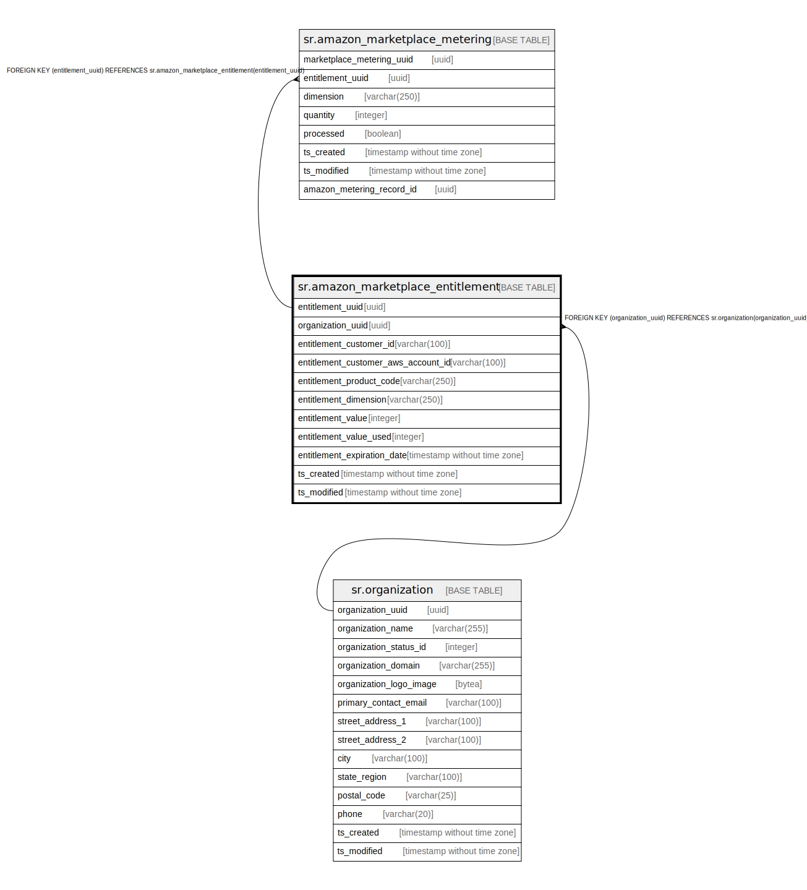

# sr.amazon_marketplace_entitlement

## Description

## Columns

| Name | Type | Default | Nullable | Children | Parents | Comment |
| ---- | ---- | ------- | -------- | -------- | ------- | ------- |
| entitlement_uuid | uuid |  | false | [sr.amazon_marketplace_metering](sr.amazon_marketplace_metering.md) |  |  |
| organization_uuid | uuid |  | true |  | [sr.organization](sr.organization.md) |  |
| entitlement_customer_id | varchar(100) |  | true |  |  |  |
| entitlement_customer_aws_account_id | varchar(100) |  | true |  |  |  |
| entitlement_product_code | varchar(250) |  | true |  |  |  |
| entitlement_dimension | varchar(250) |  | true |  |  |  |
| entitlement_value | integer | 0 | false |  |  |  |
| entitlement_value_used | integer | 0 | false |  |  |  |
| entitlement_expiration_date | timestamp without time zone |  | true |  |  |  |
| ts_created | timestamp without time zone | (now() AT TIME ZONE 'utc'::text) | true |  |  |  |
| ts_modified | timestamp without time zone | (now() AT TIME ZONE 'utc'::text) | true |  |  |  |

## Constraints

| Name | Type | Definition |
| ---- | ---- | ---------- |
| fk_organization | FOREIGN KEY | FOREIGN KEY (organization_uuid) REFERENCES sr.organization(organization_uuid) |
| amazon_marketplace_entitlement_pkey | PRIMARY KEY | PRIMARY KEY (entitlement_uuid) |

## Indexes

| Name | Definition |
| ---- | ---------- |
| amazon_marketplace_entitlement_pkey | CREATE UNIQUE INDEX amazon_marketplace_entitlement_pkey ON sr.amazon_marketplace_entitlement USING btree (entitlement_uuid) |

## Relations

---

> Generated by [tbls](https://github.com/k1LoW/tbls)
