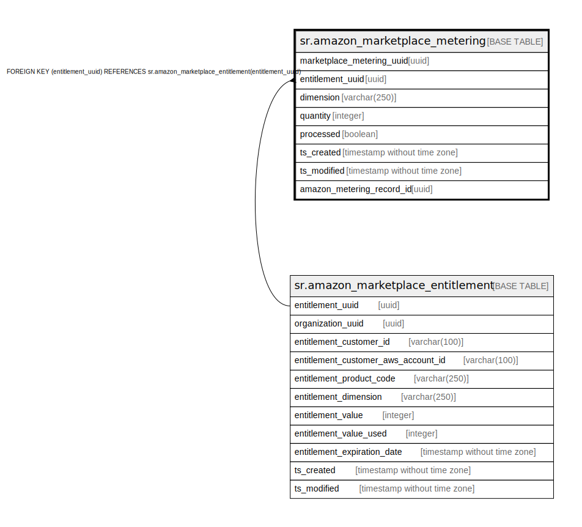

# sr.amazon_marketplace_metering

## Description

## Columns

| Name | Type | Default | Nullable | Children | Parents | Comment |
| ---- | ---- | ------- | -------- | -------- | ------- | ------- |
| marketplace_metering_uuid | uuid |  | false |  |  |  |
| entitlement_uuid | uuid |  | false |  | [sr.amazon_marketplace_entitlement](sr.amazon_marketplace_entitlement.md) |  |
| dimension | varchar(250) |  | false |  |  |  |
| quantity | integer | 0 | false |  |  |  |
| processed | boolean | false | true |  |  |  |
| ts_created | timestamp without time zone | (now() AT TIME ZONE 'utc'::text) | true |  |  |  |
| ts_modified | timestamp without time zone | (now() AT TIME ZONE 'utc'::text) | true |  |  |  |
| amazon_metering_record_id | uuid |  | true |  |  |  |

## Constraints

| Name | Type | Definition |
| ---- | ---- | ---------- |
| fk_amazon_marketplace_entitlement | FOREIGN KEY | FOREIGN KEY (entitlement_uuid) REFERENCES sr.amazon_marketplace_entitlement(entitlement_uuid) |
| amazon_marketplace_metering_pkey | PRIMARY KEY | PRIMARY KEY (marketplace_metering_uuid) |

## Indexes

| Name | Definition |
| ---- | ---------- |
| amazon_marketplace_metering_pkey | CREATE UNIQUE INDEX amazon_marketplace_metering_pkey ON sr.amazon_marketplace_metering USING btree (marketplace_metering_uuid) |

## Relations

---

> Generated by [tbls](https://github.com/k1LoW/tbls)
