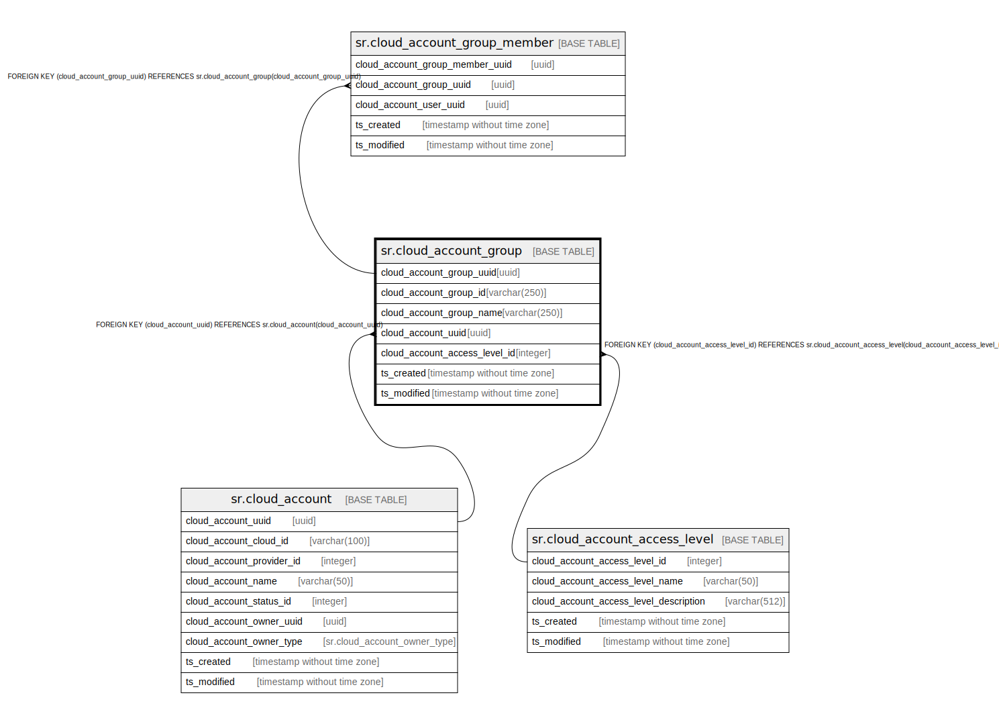

# sr.cloud_account_group

## Description

## Columns

| Name | Type | Default | Nullable | Children | Parents | Comment |
| ---- | ---- | ------- | -------- | -------- | ------- | ------- |
| cloud_account_group_uuid | uuid |  | false | [sr.cloud_account_group_member](sr.cloud_account_group_member.md) |  |  |
| cloud_account_group_id | varchar(250) |  | false |  |  |  |
| cloud_account_group_name | varchar(250) |  | true |  |  |  |
| cloud_account_uuid | uuid |  | false |  | [sr.cloud_account](sr.cloud_account.md) |  |
| cloud_account_access_level_id | integer | 1 | false |  | [sr.cloud_account_access_level](sr.cloud_account_access_level.md) |  |
| ts_created | timestamp without time zone | (now() AT TIME ZONE 'utc'::text) | true |  |  |  |
| ts_modified | timestamp without time zone | (now() AT TIME ZONE 'utc'::text) | true |  |  |  |

## Constraints

| Name | Type | Definition |
| ---- | ---- | ---------- |
| fk_cloud_account_uuid | FOREIGN KEY | FOREIGN KEY (cloud_account_uuid) REFERENCES sr.cloud_account(cloud_account_uuid) |
| fk_cloud_account_access_level | FOREIGN KEY | FOREIGN KEY (cloud_account_access_level_id) REFERENCES sr.cloud_account_access_level(cloud_account_access_level_id) |
| cloud_account_group_pkey | PRIMARY KEY | PRIMARY KEY (cloud_account_group_uuid) |

## Indexes

| Name | Definition |
| ---- | ---------- |
| cloud_account_group_pkey | CREATE UNIQUE INDEX cloud_account_group_pkey ON sr.cloud_account_group USING btree (cloud_account_group_uuid) |

## Relations

---

> Generated by [tbls](https://github.com/k1LoW/tbls)
