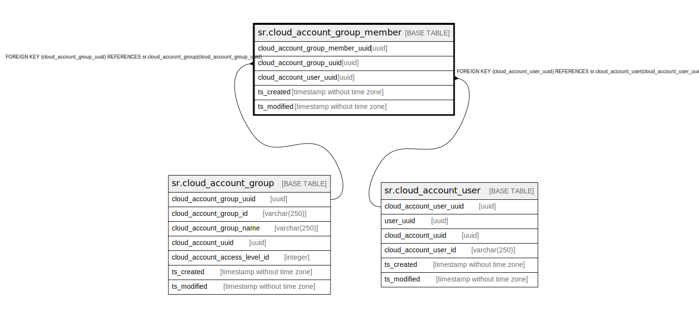

# sr.cloud_account_group_member

## Description

## Columns

| Name | Type | Default | Nullable | Children | Parents | Comment |
| ---- | ---- | ------- | -------- | -------- | ------- | ------- |
| cloud_account_group_member_uuid | uuid |  | false |  |  |  |
| cloud_account_group_uuid | uuid |  | false |  | [sr.cloud_account_group](sr.cloud_account_group.md) |  |
| cloud_account_user_uuid | uuid |  | false |  | [sr.cloud_account_user](sr.cloud_account_user.md) |  |
| ts_created | timestamp without time zone | (now() AT TIME ZONE 'utc'::text) | true |  |  |  |
| ts_modified | timestamp without time zone | (now() AT TIME ZONE 'utc'::text) | true |  |  |  |

## Constraints

| Name | Type | Definition |
| ---- | ---- | ---------- |
| fk_cloud_account_user | FOREIGN KEY | FOREIGN KEY (cloud_account_user_uuid) REFERENCES sr.cloud_account_user(cloud_account_user_uuid) |
| fk_cloud_account_group | FOREIGN KEY | FOREIGN KEY (cloud_account_group_uuid) REFERENCES sr.cloud_account_group(cloud_account_group_uuid) |
| cloud_account_group_member_pkey | PRIMARY KEY | PRIMARY KEY (cloud_account_group_member_uuid) |

## Indexes

| Name | Definition |
| ---- | ---------- |
| cloud_account_group_member_pkey | CREATE UNIQUE INDEX cloud_account_group_member_pkey ON sr.cloud_account_group_member USING btree (cloud_account_group_member_uuid) |

## Relations

---

> Generated by [tbls](https://github.com/k1LoW/tbls)
