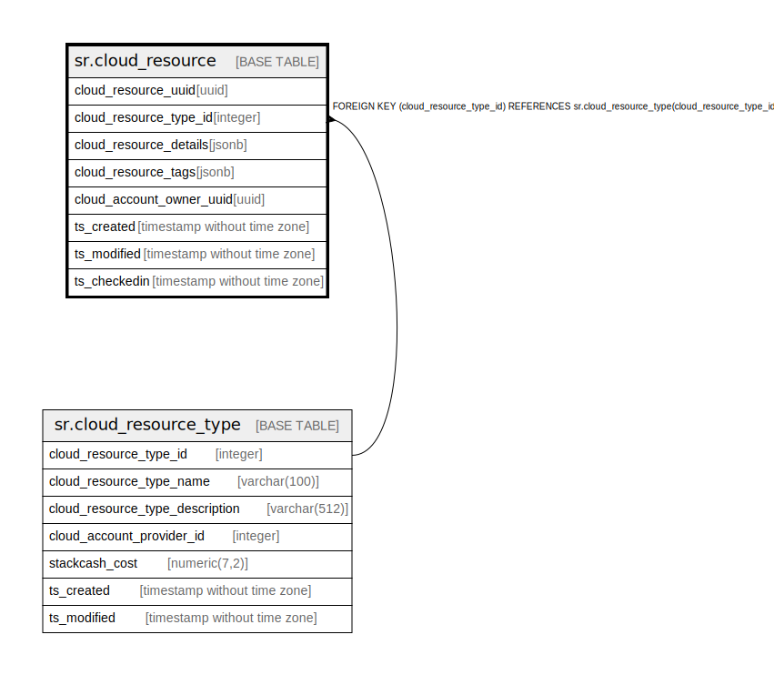

# sr.cloud_resource

## Description

## Columns

| Name | Type | Default | Nullable | Children | Parents | Comment |
| ---- | ---- | ------- | -------- | -------- | ------- | ------- |
| cloud_resource_uuid | uuid |  | false |  |  |  |
| cloud_resource_type_id | integer | 1 | false |  | [sr.cloud_resource_type](sr.cloud_resource_type.md) |  |
| cloud_resource_details | jsonb |  | true |  |  |  |
| cloud_resource_tags | jsonb |  | true |  |  |  |
| cloud_account_owner_uuid | uuid |  | true |  |  |  |
| ts_created | timestamp without time zone | (now() AT TIME ZONE 'utc'::text) | true |  |  |  |
| ts_modified | timestamp without time zone | (now() AT TIME ZONE 'utc'::text) | true |  |  |  |
| ts_checkedin | timestamp without time zone | (now() AT TIME ZONE 'utc'::text) | true |  |  |  |

## Constraints

| Name | Type | Definition |
| ---- | ---- | ---------- |
| fk_cloud_resource_type_id | FOREIGN KEY | FOREIGN KEY (cloud_resource_type_id) REFERENCES sr.cloud_resource_type(cloud_resource_type_id) |
| cloud_resource_pk | PRIMARY KEY | PRIMARY KEY (cloud_resource_uuid) |

## Indexes

| Name | Definition |
| ---- | ---------- |
| cloud_resource_pk | CREATE UNIQUE INDEX cloud_resource_pk ON sr.cloud_resource USING btree (cloud_resource_uuid) |

## Relations

---

> Generated by [tbls](https://github.com/k1LoW/tbls)
