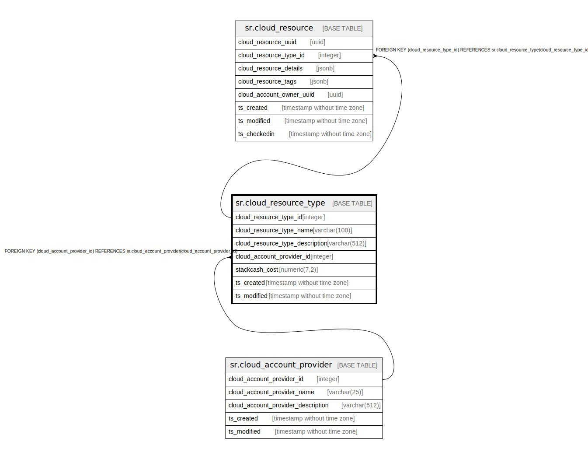

# sr.cloud_resource_type

## Description

## Columns

| Name | Type | Default | Nullable | Children | Parents | Comment |
| ---- | ---- | ------- | -------- | -------- | ------- | ------- |
| cloud_resource_type_id | integer |  | false | [sr.cloud_resource](sr.cloud_resource.md) |  |  |
| cloud_resource_type_name | varchar(100) |  | false |  |  |  |
| cloud_resource_type_description | varchar(512) |  | true |  |  |  |
| cloud_account_provider_id | integer |  | false |  | [sr.cloud_account_provider](sr.cloud_account_provider.md) |  |
| stackcash_cost | numeric(7,2) | 0.00 | false |  |  |  |
| ts_created | timestamp without time zone | (now() AT TIME ZONE 'utc'::text) | true |  |  |  |
| ts_modified | timestamp without time zone | (now() AT TIME ZONE 'utc'::text) | true |  |  |  |

## Constraints

| Name | Type | Definition |
| ---- | ---- | ---------- |
| fk_cloud_account_provider | FOREIGN KEY | FOREIGN KEY (cloud_account_provider_id) REFERENCES sr.cloud_account_provider(cloud_account_provider_id) |
| cloud_resource_type_pkey | PRIMARY KEY | PRIMARY KEY (cloud_resource_type_id) |

## Indexes

| Name | Definition |
| ---- | ---------- |
| cloud_resource_type_pkey | CREATE UNIQUE INDEX cloud_resource_type_pkey ON sr.cloud_resource_type USING btree (cloud_resource_type_id) |

## Relations

---

> Generated by [tbls](https://github.com/k1LoW/tbls)
