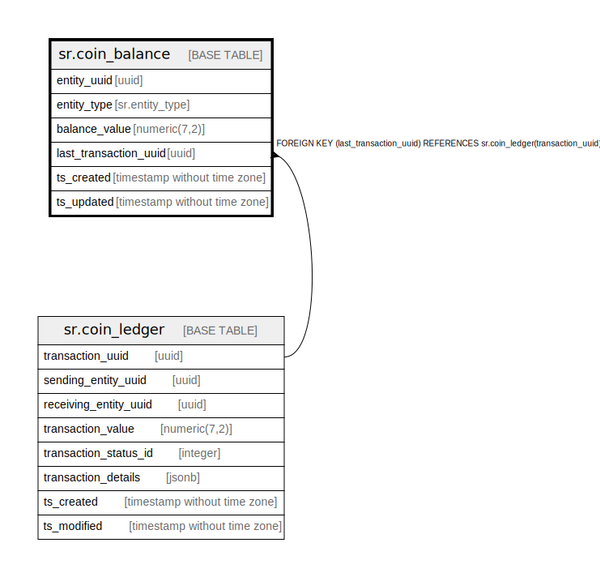

# sr.coin_balance

## Description

## Columns

| Name | Type | Default | Nullable | Children | Parents | Comment |
| ---- | ---- | ------- | -------- | -------- | ------- | ------- |
| entity_uuid | uuid |  | false |  |  |  |
| entity_type | sr.entity_type |  | true |  |  |  |
| balance_value | numeric(7,2) |  | false |  |  |  |
| last_transaction_uuid | uuid |  | false |  | [sr.coin_ledger](sr.coin_ledger.md) |  |
| ts_created | timestamp without time zone | (now() AT TIME ZONE 'utc'::text) | true |  |  |  |
| ts_updated | timestamp without time zone | (now() AT TIME ZONE 'utc'::text) | true |  |  |  |

## Constraints

| Name | Type | Definition |
| ---- | ---- | ---------- |
| fk_coin_ledger | FOREIGN KEY | FOREIGN KEY (last_transaction_uuid) REFERENCES sr.coin_ledger(transaction_uuid) |
| coin_balance_pkey | PRIMARY KEY | PRIMARY KEY (entity_uuid) |

## Indexes

| Name | Definition |
| ---- | ---------- |
| coin_balance_pkey | CREATE UNIQUE INDEX coin_balance_pkey ON sr.coin_balance USING btree (entity_uuid) |

## Relations

---

> Generated by [tbls](https://github.com/k1LoW/tbls)
