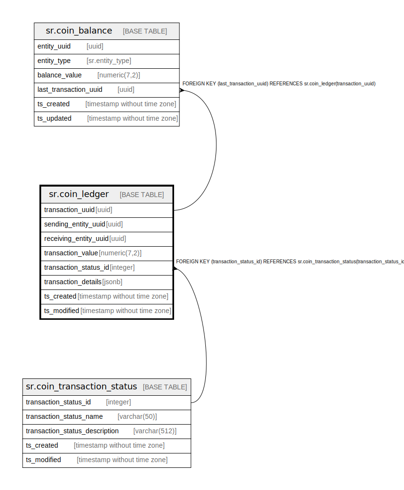

# sr.coin_ledger

## Description

## Columns

| Name | Type | Default | Nullable | Children | Parents | Comment |
| ---- | ---- | ------- | -------- | -------- | ------- | ------- |
| transaction_uuid | uuid |  | false | [sr.coin_balance](sr.coin_balance.md) |  |  |
| sending_entity_uuid | uuid |  | true |  |  |  |
| receiving_entity_uuid | uuid |  | true |  |  |  |
| transaction_value | numeric(7,2) |  | false |  |  |  |
| transaction_status_id | integer | 1 | false |  | [sr.coin_transaction_status](sr.coin_transaction_status.md) |  |
| transaction_details | jsonb |  | true |  |  |  |
| ts_created | timestamp without time zone | (now() AT TIME ZONE 'utc'::text) | true |  |  |  |
| ts_modified | timestamp without time zone | (now() AT TIME ZONE 'utc'::text) | true |  |  |  |

## Constraints

| Name | Type | Definition |
| ---- | ---- | ---------- |
| fk_transaction_status | FOREIGN KEY | FOREIGN KEY (transaction_status_id) REFERENCES sr.coin_transaction_status(transaction_status_id) |
| coin_ledger_pkey | PRIMARY KEY | PRIMARY KEY (transaction_uuid) |

## Indexes

| Name | Definition |
| ---- | ---------- |
| coin_ledger_pkey | CREATE UNIQUE INDEX coin_ledger_pkey ON sr.coin_ledger USING btree (transaction_uuid) |

## Relations

---

> Generated by [tbls](https://github.com/k1LoW/tbls)
