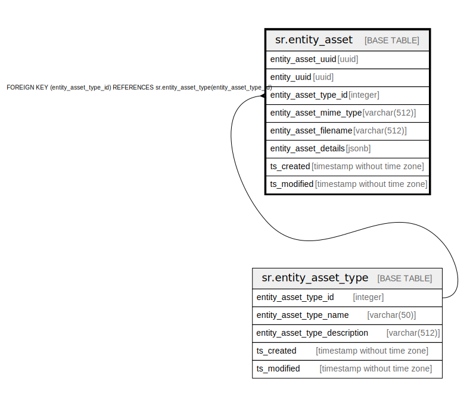

# sr.entity_asset

## Description

## Columns

| Name | Type | Default | Nullable | Children | Parents | Comment |
| ---- | ---- | ------- | -------- | -------- | ------- | ------- |
| entity_asset_uuid | uuid |  | false |  |  |  |
| entity_uuid | uuid | '00000000-0000-0000-0000-000000000000'::uuid | false |  |  |  |
| entity_asset_type_id | integer | 1 | false |  | [sr.entity_asset_type](sr.entity_asset_type.md) |  |
| entity_asset_mime_type | varchar(512) |  | true |  |  |  |
| entity_asset_filename | varchar(512) |  | true |  |  |  |
| entity_asset_details | jsonb |  | true |  |  |  |
| ts_created | timestamp without time zone | (now() AT TIME ZONE 'utc'::text) | true |  |  |  |
| ts_modified | timestamp without time zone | (now() AT TIME ZONE 'utc'::text) | true |  |  |  |

## Constraints

| Name | Type | Definition |
| ---- | ---- | ---------- |
| fk_entity_asset_type_id | FOREIGN KEY | FOREIGN KEY (entity_asset_type_id) REFERENCES sr.entity_asset_type(entity_asset_type_id) |
| entity_asset_pkey | PRIMARY KEY | PRIMARY KEY (entity_asset_uuid) |

## Indexes

| Name | Definition |
| ---- | ---------- |
| entity_asset_pkey | CREATE UNIQUE INDEX entity_asset_pkey ON sr.entity_asset USING btree (entity_asset_uuid) |

## Relations

---

> Generated by [tbls](https://github.com/k1LoW/tbls)
