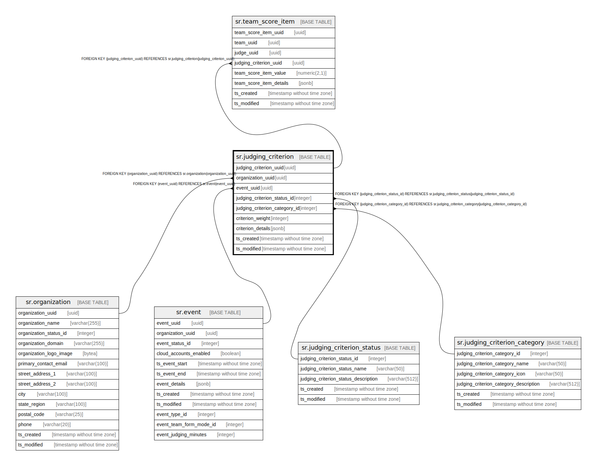

# sr.judging_criterion

## Description

## Columns

| Name | Type | Default | Nullable | Children | Parents | Comment |
| ---- | ---- | ------- | -------- | -------- | ------- | ------- |
| judging_criterion_uuid | uuid |  | false | [sr.team_score_item](sr.team_score_item.md) |  |  |
| organization_uuid | uuid |  | false |  | [sr.organization](sr.organization.md) |  |
| event_uuid | uuid |  | false |  | [sr.event](sr.event.md) |  |
| judging_criterion_status_id | integer | 1 | false |  | [sr.judging_criterion_status](sr.judging_criterion_status.md) |  |
| judging_criterion_category_id | integer | 1 | false |  | [sr.judging_criterion_category](sr.judging_criterion_category.md) |  |
| criterion_weight | integer | 0 | true |  |  |  |
| criterion_details | jsonb |  | true |  |  |  |
| ts_created | timestamp without time zone | (now() AT TIME ZONE 'utc'::text) | true |  |  |  |
| ts_modified | timestamp without time zone | (now() AT TIME ZONE 'utc'::text) | true |  |  |  |

## Constraints

| Name | Type | Definition |
| ---- | ---- | ---------- |
| fk_organization | FOREIGN KEY | FOREIGN KEY (organization_uuid) REFERENCES sr.organization(organization_uuid) |
| fk_event | FOREIGN KEY | FOREIGN KEY (event_uuid) REFERENCES sr.event(event_uuid) |
| fk_judging_criterion_status | FOREIGN KEY | FOREIGN KEY (judging_criterion_status_id) REFERENCES sr.judging_criterion_status(judging_criterion_status_id) |
| fk_judging_criterion_category | FOREIGN KEY | FOREIGN KEY (judging_criterion_category_id) REFERENCES sr.judging_criterion_category(judging_criterion_category_id) |
| judging_criterion_pkey | PRIMARY KEY | PRIMARY KEY (judging_criterion_uuid) |

## Indexes

| Name | Definition |
| ---- | ---------- |
| judging_criterion_pkey | CREATE UNIQUE INDEX judging_criterion_pkey ON sr.judging_criterion USING btree (judging_criterion_uuid) |

## Relations

---

> Generated by [tbls](https://github.com/k1LoW/tbls)
