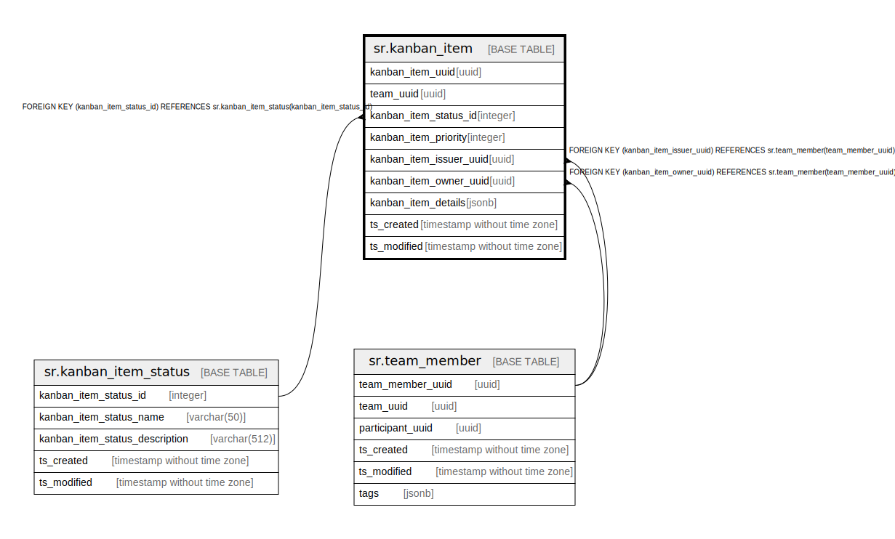

# sr.kanban_item

## Description

## Columns

| Name | Type | Default | Nullable | Children | Parents | Comment |
| ---- | ---- | ------- | -------- | -------- | ------- | ------- |
| kanban_item_uuid | uuid |  | false |  |  |  |
| team_uuid | uuid |  | false |  |  |  |
| kanban_item_status_id | integer | 1 | false |  | [sr.kanban_item_status](sr.kanban_item_status.md) |  |
| kanban_item_priority | integer | 1 | false |  |  |  |
| kanban_item_issuer_uuid | uuid |  | true |  | [sr.team_member](sr.team_member.md) |  |
| kanban_item_owner_uuid | uuid |  | true |  | [sr.team_member](sr.team_member.md) |  |
| kanban_item_details | jsonb |  | true |  |  |  |
| ts_created | timestamp without time zone | (now() AT TIME ZONE 'utc'::text) | true |  |  |  |
| ts_modified | timestamp without time zone | (now() AT TIME ZONE 'utc'::text) | true |  |  |  |

## Constraints

| Name | Type | Definition |
| ---- | ---- | ---------- |
| fk_team_member_issuer | FOREIGN KEY | FOREIGN KEY (kanban_item_issuer_uuid) REFERENCES sr.team_member(team_member_uuid) |
| fk_team_member_owner | FOREIGN KEY | FOREIGN KEY (kanban_item_owner_uuid) REFERENCES sr.team_member(team_member_uuid) |
| fk_kanban_item_status | FOREIGN KEY | FOREIGN KEY (kanban_item_status_id) REFERENCES sr.kanban_item_status(kanban_item_status_id) |
| kanban_item_pkey | PRIMARY KEY | PRIMARY KEY (kanban_item_uuid) |

## Indexes

| Name | Definition |
| ---- | ---------- |
| kanban_item_pkey | CREATE UNIQUE INDEX kanban_item_pkey ON sr.kanban_item USING btree (kanban_item_uuid) |

## Relations

---

> Generated by [tbls](https://github.com/k1LoW/tbls)
