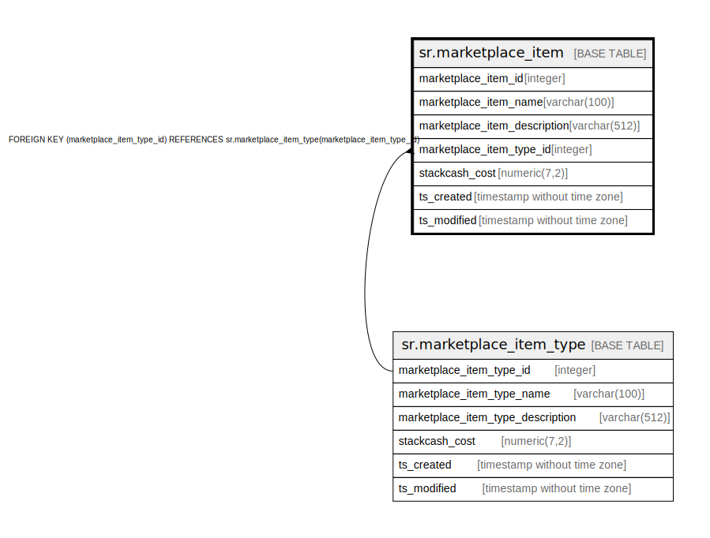

# sr.marketplace_item

## Description

## Columns

| Name | Type | Default | Nullable | Children | Parents | Comment |
| ---- | ---- | ------- | -------- | -------- | ------- | ------- |
| marketplace_item_id | integer |  | false |  |  |  |
| marketplace_item_name | varchar(100) |  | false |  |  |  |
| marketplace_item_description | varchar(512) |  | true |  |  |  |
| marketplace_item_type_id | integer | 1 | false |  | [sr.marketplace_item_type](sr.marketplace_item_type.md) |  |
| stackcash_cost | numeric(7,2) | 0.00 | false |  |  |  |
| ts_created | timestamp without time zone | (now() AT TIME ZONE 'utc'::text) | true |  |  |  |
| ts_modified | timestamp without time zone | (now() AT TIME ZONE 'utc'::text) | true |  |  |  |

## Constraints

| Name | Type | Definition |
| ---- | ---- | ---------- |
| fk_marketplace_item_type_id | FOREIGN KEY | FOREIGN KEY (marketplace_item_type_id) REFERENCES sr.marketplace_item_type(marketplace_item_type_id) |
| marketplace_item_pkey | PRIMARY KEY | PRIMARY KEY (marketplace_item_id) |

## Indexes

| Name | Definition |
| ---- | ---------- |
| marketplace_item_pkey | CREATE UNIQUE INDEX marketplace_item_pkey ON sr.marketplace_item USING btree (marketplace_item_id) |

## Relations

---

> Generated by [tbls](https://github.com/k1LoW/tbls)
