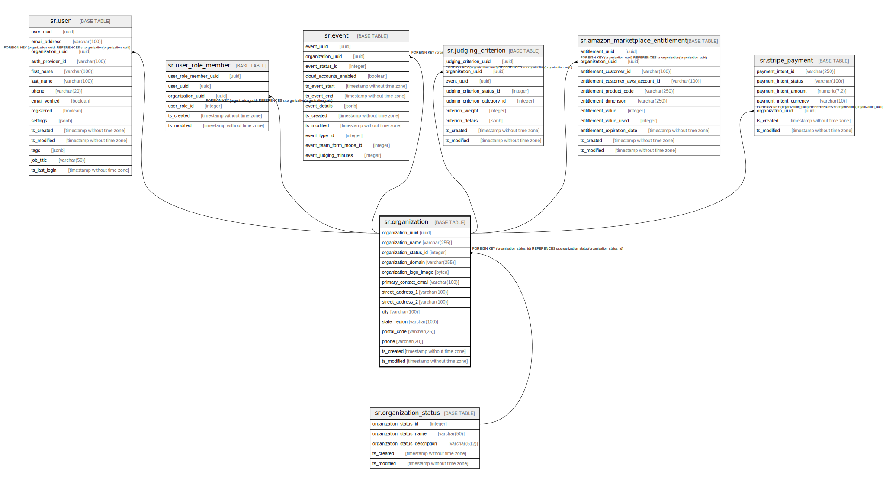

# sr.organization

## Description

## Columns

| Name | Type | Default | Nullable | Children | Parents | Comment |
| ---- | ---- | ------- | -------- | -------- | ------- | ------- |
| organization_uuid | uuid |  | false | [sr.user](sr.user.md) [sr.user_role_member](sr.user_role_member.md) [sr.event](sr.event.md) [sr.judging_criterion](sr.judging_criterion.md) [sr.amazon_marketplace_entitlement](sr.amazon_marketplace_entitlement.md) [sr.stripe_payment](sr.stripe_payment.md) |  |  |
| organization_name | varchar(255) |  | false |  |  |  |
| organization_status_id | integer | 1 | false |  | [sr.organization_status](sr.organization_status.md) |  |
| organization_domain | varchar(255) |  | true |  |  |  |
| organization_logo_image | bytea |  | true |  |  |  |
| primary_contact_email | varchar(100) |  | true |  |  |  |
| street_address_1 | varchar(100) |  | true |  |  |  |
| street_address_2 | varchar(100) |  | true |  |  |  |
| city | varchar(100) |  | true |  |  |  |
| state_region | varchar(100) |  | true |  |  |  |
| postal_code | varchar(25) |  | true |  |  |  |
| phone | varchar(20) |  | true |  |  |  |
| ts_created | timestamp without time zone | (now() AT TIME ZONE 'utc'::text) | true |  |  |  |
| ts_modified | timestamp without time zone | (now() AT TIME ZONE 'utc'::text) | true |  |  |  |

## Constraints

| Name | Type | Definition |
| ---- | ---- | ---------- |
| fk_organization_status | FOREIGN KEY | FOREIGN KEY (organization_status_id) REFERENCES sr.organization_status(organization_status_id) |
| organization_pkey | PRIMARY KEY | PRIMARY KEY (organization_uuid) |

## Indexes

| Name | Definition |
| ---- | ---------- |
| organization_pkey | CREATE UNIQUE INDEX organization_pkey ON sr.organization USING btree (organization_uuid) |

## Relations

---

> Generated by [tbls](https://github.com/k1LoW/tbls)
