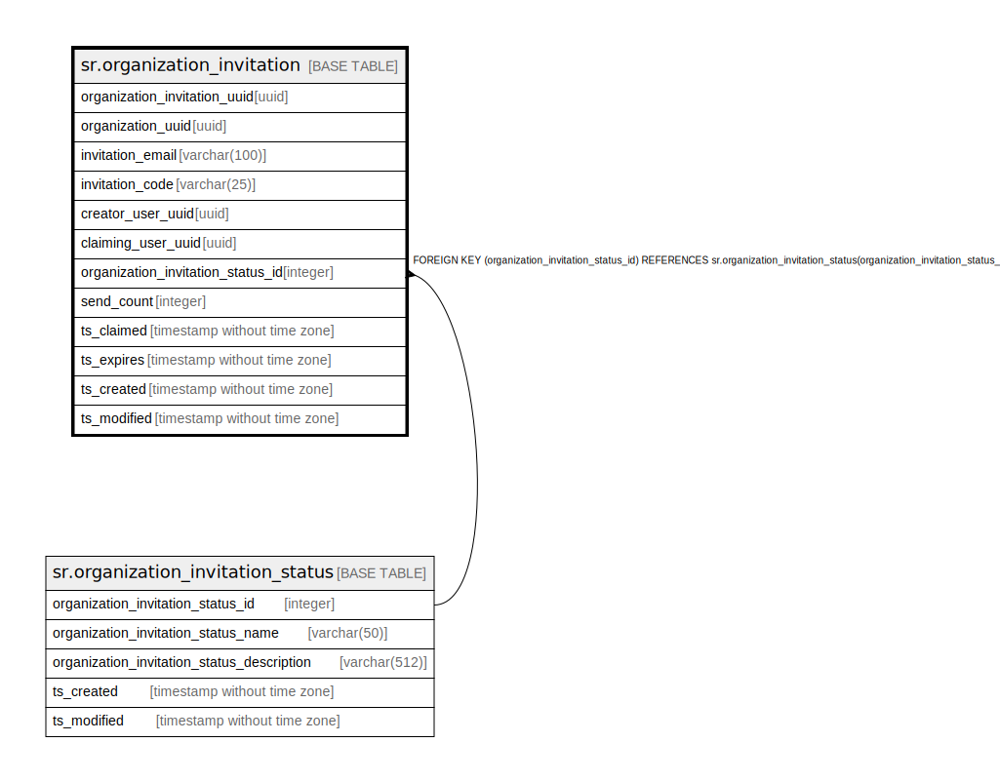

# sr.organization_invitation

## Description

## Columns

| Name | Type | Default | Nullable | Children | Parents | Comment |
| ---- | ---- | ------- | -------- | -------- | ------- | ------- |
| organization_invitation_uuid | uuid |  | false |  |  |  |
| organization_uuid | uuid |  | false |  |  |  |
| invitation_email | varchar(100) |  | true |  |  |  |
| invitation_code | varchar(25) |  | true |  |  |  |
| creator_user_uuid | uuid |  | true |  |  |  |
| claiming_user_uuid | uuid |  | true |  |  |  |
| organization_invitation_status_id | integer | 1 | false |  | [sr.organization_invitation_status](sr.organization_invitation_status.md) |  |
| send_count | integer | 0 | false |  |  |  |
| ts_claimed | timestamp without time zone |  | true |  |  |  |
| ts_expires | timestamp without time zone |  | true |  |  |  |
| ts_created | timestamp without time zone | (now() AT TIME ZONE 'utc'::text) | true |  |  |  |
| ts_modified | timestamp without time zone | (now() AT TIME ZONE 'utc'::text) | true |  |  |  |

## Constraints

| Name | Type | Definition |
| ---- | ---- | ---------- |
| fk_organization_invitation_status | FOREIGN KEY | FOREIGN KEY (organization_invitation_status_id) REFERENCES sr.organization_invitation_status(organization_invitation_status_id) |
| organization_invitation_pkey | PRIMARY KEY | PRIMARY KEY (organization_invitation_uuid) |

## Indexes

| Name | Definition |
| ---- | ---------- |
| organization_invitation_pkey | CREATE UNIQUE INDEX organization_invitation_pkey ON sr.organization_invitation USING btree (organization_invitation_uuid) |

## Relations

---

> Generated by [tbls](https://github.com/k1LoW/tbls)
