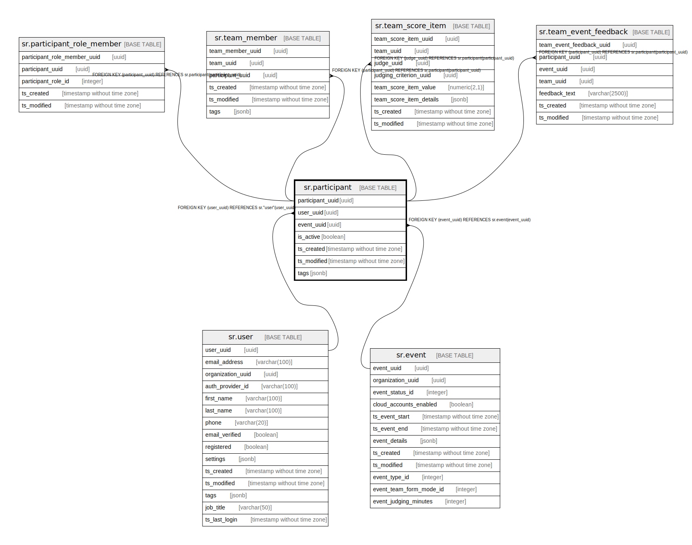

# sr.participant

## Description

## Columns

| Name | Type | Default | Nullable | Children | Parents | Comment |
| ---- | ---- | ------- | -------- | -------- | ------- | ------- |
| participant_uuid | uuid |  | false | [sr.participant_role_member](sr.participant_role_member.md) [sr.team_member](sr.team_member.md) [sr.team_score_item](sr.team_score_item.md) [sr.team_event_feedback](sr.team_event_feedback.md) |  |  |
| user_uuid | uuid |  | false |  | [sr.user](sr.user.md) |  |
| event_uuid | uuid |  | false |  | [sr.event](sr.event.md) |  |
| is_active | boolean | false | true |  |  |  |
| ts_created | timestamp without time zone | (now() AT TIME ZONE 'utc'::text) | true |  |  |  |
| ts_modified | timestamp without time zone | (now() AT TIME ZONE 'utc'::text) | true |  |  |  |
| tags | jsonb |  | true |  |  |  |

## Constraints

| Name | Type | Definition |
| ---- | ---- | ---------- |
| fk_user | FOREIGN KEY | FOREIGN KEY (user_uuid) REFERENCES sr."user"(user_uuid) |
| fk_event | FOREIGN KEY | FOREIGN KEY (event_uuid) REFERENCES sr.event(event_uuid) |
| participant_pkey | PRIMARY KEY | PRIMARY KEY (participant_uuid) |

## Indexes

| Name | Definition |
| ---- | ---------- |
| participant_pkey | CREATE UNIQUE INDEX participant_pkey ON sr.participant USING btree (participant_uuid) |

## Relations

---

> Generated by [tbls](https://github.com/k1LoW/tbls)
