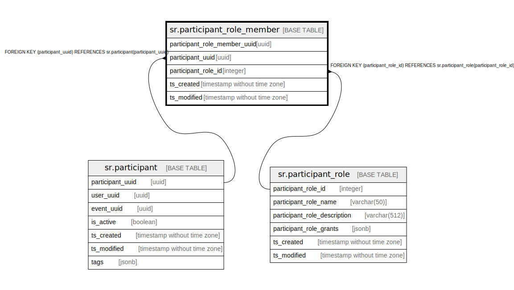

# sr.participant_role_member

## Description

## Columns

| Name | Type | Default | Nullable | Children | Parents | Comment |
| ---- | ---- | ------- | -------- | -------- | ------- | ------- |
| participant_role_member_uuid | uuid |  | false |  |  |  |
| participant_uuid | uuid |  | false |  | [sr.participant](sr.participant.md) |  |
| participant_role_id | integer | 1 | false |  | [sr.participant_role](sr.participant_role.md) |  |
| ts_created | timestamp without time zone | (now() AT TIME ZONE 'utc'::text) | true |  |  |  |
| ts_modified | timestamp without time zone | (now() AT TIME ZONE 'utc'::text) | true |  |  |  |

## Constraints

| Name | Type | Definition |
| ---- | ---- | ---------- |
| fk_participant_uuid | FOREIGN KEY | FOREIGN KEY (participant_uuid) REFERENCES sr.participant(participant_uuid) |
| fk_participant_role_id | FOREIGN KEY | FOREIGN KEY (participant_role_id) REFERENCES sr.participant_role(participant_role_id) |
| participant_role_member_pkey | PRIMARY KEY | PRIMARY KEY (participant_role_member_uuid) |

## Indexes

| Name | Definition |
| ---- | ---------- |
| participant_role_member_pkey | CREATE UNIQUE INDEX participant_role_member_pkey ON sr.participant_role_member USING btree (participant_role_member_uuid) |

## Relations

---

> Generated by [tbls](https://github.com/k1LoW/tbls)
