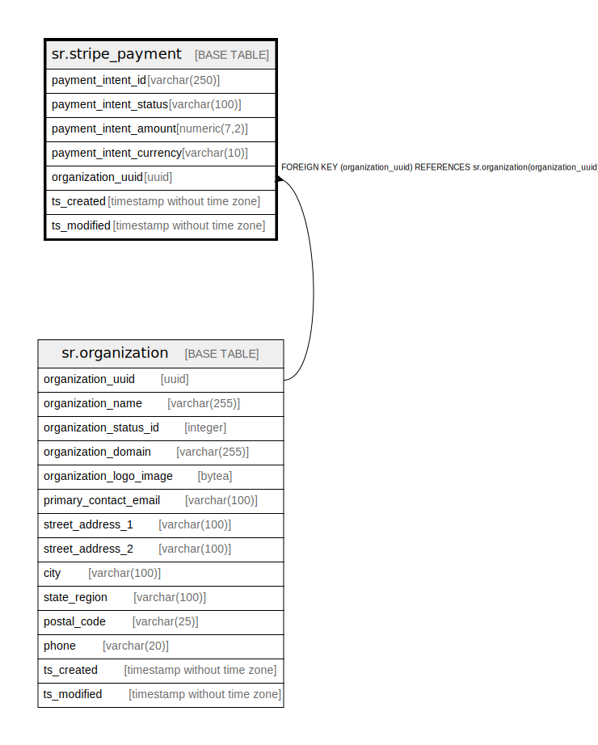

# sr.stripe_payment

## Description

## Columns

| Name | Type | Default | Nullable | Children | Parents | Comment |
| ---- | ---- | ------- | -------- | -------- | ------- | ------- |
| payment_intent_id | varchar(250) |  | false |  |  |  |
| payment_intent_status | varchar(100) |  | false |  |  |  |
| payment_intent_amount | numeric(7,2) |  | false |  |  |  |
| payment_intent_currency | varchar(10) |  | false |  |  |  |
| organization_uuid | uuid |  | true |  | [sr.organization](sr.organization.md) |  |
| ts_created | timestamp without time zone | (now() AT TIME ZONE 'utc'::text) | true |  |  |  |
| ts_modified | timestamp without time zone | (now() AT TIME ZONE 'utc'::text) | true |  |  |  |

## Constraints

| Name | Type | Definition |
| ---- | ---- | ---------- |
| fk_organization | FOREIGN KEY | FOREIGN KEY (organization_uuid) REFERENCES sr.organization(organization_uuid) |
| stripe_payment_pkey | PRIMARY KEY | PRIMARY KEY (payment_intent_id) |

## Indexes

| Name | Definition |
| ---- | ---------- |
| stripe_payment_pkey | CREATE UNIQUE INDEX stripe_payment_pkey ON sr.stripe_payment USING btree (payment_intent_id) |

## Relations

---

> Generated by [tbls](https://github.com/k1LoW/tbls)
