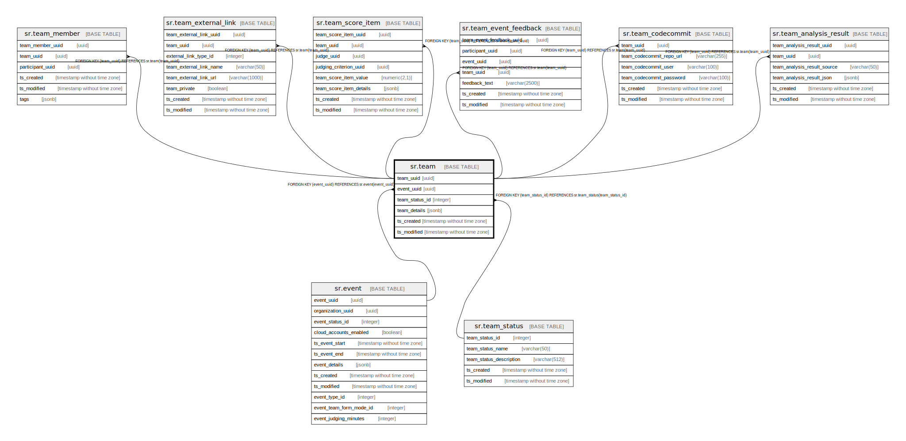

# sr.team

## Description

## Columns

| Name | Type | Default | Nullable | Children | Parents | Comment |
| ---- | ---- | ------- | -------- | -------- | ------- | ------- |
| team_uuid | uuid |  | false | [sr.team_member](sr.team_member.md) [sr.team_external_link](sr.team_external_link.md) [sr.team_score_item](sr.team_score_item.md) [sr.team_event_feedback](sr.team_event_feedback.md) [sr.team_codecommit](sr.team_codecommit.md) [sr.team_analysis_result](sr.team_analysis_result.md) |  |  |
| event_uuid | uuid |  | true |  | [sr.event](sr.event.md) |  |
| team_status_id | integer | 1 | false |  | [sr.team_status](sr.team_status.md) |  |
| team_details | jsonb |  | true |  |  |  |
| ts_created | timestamp without time zone | (now() AT TIME ZONE 'utc'::text) | true |  |  |  |
| ts_modified | timestamp without time zone | (now() AT TIME ZONE 'utc'::text) | true |  |  |  |

## Constraints

| Name | Type | Definition |
| ---- | ---- | ---------- |
| fk_event | FOREIGN KEY | FOREIGN KEY (event_uuid) REFERENCES sr.event(event_uuid) |
| fk_team_status | FOREIGN KEY | FOREIGN KEY (team_status_id) REFERENCES sr.team_status(team_status_id) |
| team_pkey | PRIMARY KEY | PRIMARY KEY (team_uuid) |

## Indexes

| Name | Definition |
| ---- | ---------- |
| team_pkey | CREATE UNIQUE INDEX team_pkey ON sr.team USING btree (team_uuid) |

## Relations

---

> Generated by [tbls](https://github.com/k1LoW/tbls)
