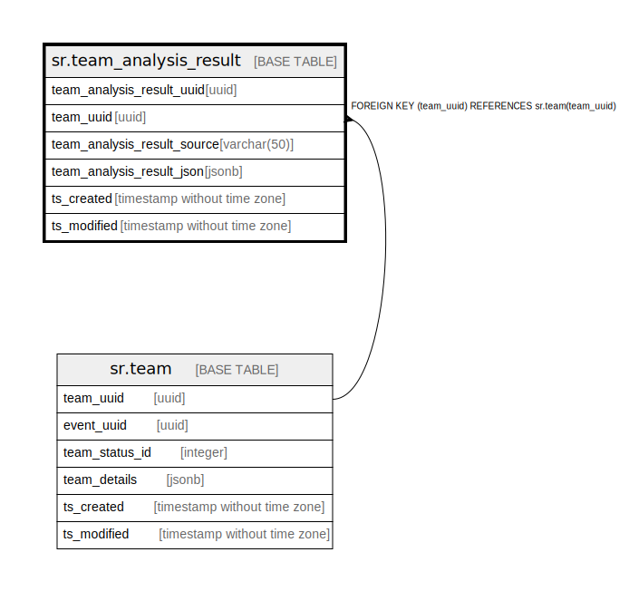

# sr.team_analysis_result

## Description

## Columns

| Name | Type | Default | Nullable | Children | Parents | Comment |
| ---- | ---- | ------- | -------- | -------- | ------- | ------- |
| team_analysis_result_uuid | uuid |  | false |  |  |  |
| team_uuid | uuid | '00000000-0000-0000-0000-000000000000'::uuid | false |  | [sr.team](sr.team.md) |  |
| team_analysis_result_source | varchar(50) |  | true |  |  |  |
| team_analysis_result_json | jsonb |  | true |  |  |  |
| ts_created | timestamp without time zone | (now() AT TIME ZONE 'utc'::text) | true |  |  |  |
| ts_modified | timestamp without time zone | (now() AT TIME ZONE 'utc'::text) | true |  |  |  |

## Constraints

| Name | Type | Definition |
| ---- | ---- | ---------- |
| fk_team | FOREIGN KEY | FOREIGN KEY (team_uuid) REFERENCES sr.team(team_uuid) |
| team_analysis_result_pkey | PRIMARY KEY | PRIMARY KEY (team_analysis_result_uuid) |

## Indexes

| Name | Definition |
| ---- | ---------- |
| team_analysis_result_pkey | CREATE UNIQUE INDEX team_analysis_result_pkey ON sr.team_analysis_result USING btree (team_analysis_result_uuid) |

## Relations

---

> Generated by [tbls](https://github.com/k1LoW/tbls)
