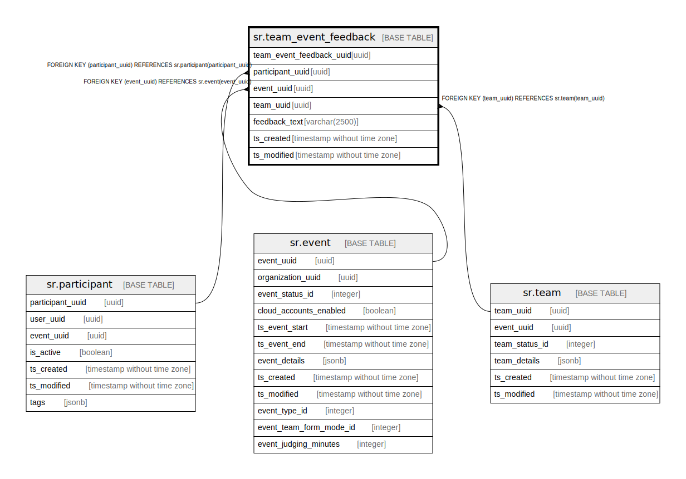

# sr.team_event_feedback

## Description

## Columns

| Name | Type | Default | Nullable | Children | Parents | Comment |
| ---- | ---- | ------- | -------- | -------- | ------- | ------- |
| team_event_feedback_uuid | uuid |  | false |  |  |  |
| participant_uuid | uuid |  | false |  | [sr.participant](sr.participant.md) |  |
| event_uuid | uuid | '00000000-0000-0000-0000-000000000000'::uuid | false |  | [sr.event](sr.event.md) |  |
| team_uuid | uuid | '00000000-0000-0000-0000-000000000000'::uuid | false |  | [sr.team](sr.team.md) |  |
| feedback_text | varchar(2500) |  | true |  |  |  |
| ts_created | timestamp without time zone | (now() AT TIME ZONE 'utc'::text) | true |  |  |  |
| ts_modified | timestamp without time zone | (now() AT TIME ZONE 'utc'::text) | true |  |  |  |

## Constraints

| Name | Type | Definition |
| ---- | ---- | ---------- |
| fk_event | FOREIGN KEY | FOREIGN KEY (event_uuid) REFERENCES sr.event(event_uuid) |
| fk_participant | FOREIGN KEY | FOREIGN KEY (participant_uuid) REFERENCES sr.participant(participant_uuid) |
| fk_team | FOREIGN KEY | FOREIGN KEY (team_uuid) REFERENCES sr.team(team_uuid) |
| team_event_feedback_pkey | PRIMARY KEY | PRIMARY KEY (team_event_feedback_uuid) |
| unique_feedback | UNIQUE | UNIQUE (participant_uuid, event_uuid, team_uuid) |

## Indexes

| Name | Definition |
| ---- | ---------- |
| team_event_feedback_pkey | CREATE UNIQUE INDEX team_event_feedback_pkey ON sr.team_event_feedback USING btree (team_event_feedback_uuid) |
| unique_feedback | CREATE UNIQUE INDEX unique_feedback ON sr.team_event_feedback USING btree (participant_uuid, event_uuid, team_uuid) |

## Relations

---

> Generated by [tbls](https://github.com/k1LoW/tbls)
