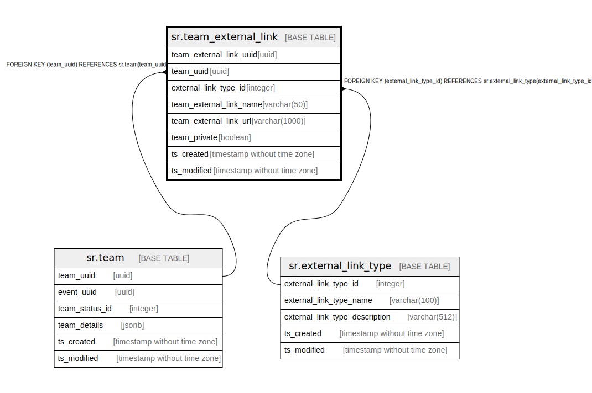

# sr.team_external_link

## Description

## Columns

| Name | Type | Default | Nullable | Children | Parents | Comment |
| ---- | ---- | ------- | -------- | -------- | ------- | ------- |
| team_external_link_uuid | uuid |  | false |  |  |  |
| team_uuid | uuid |  | false |  | [sr.team](sr.team.md) |  |
| external_link_type_id | integer | 1 | false |  | [sr.external_link_type](sr.external_link_type.md) |  |
| team_external_link_name | varchar(50) |  | true |  |  |  |
| team_external_link_url | varchar(1000) |  | true |  |  |  |
| team_private | boolean | true | true |  |  |  |
| ts_created | timestamp without time zone | (now() AT TIME ZONE 'utc'::text) | true |  |  |  |
| ts_modified | timestamp without time zone | (now() AT TIME ZONE 'utc'::text) | true |  |  |  |

## Constraints

| Name | Type | Definition |
| ---- | ---- | ---------- |
| fk_team | FOREIGN KEY | FOREIGN KEY (team_uuid) REFERENCES sr.team(team_uuid) |
| fk_external_link_type | FOREIGN KEY | FOREIGN KEY (external_link_type_id) REFERENCES sr.external_link_type(external_link_type_id) |
| team_external_link_pkey | PRIMARY KEY | PRIMARY KEY (team_external_link_uuid) |

## Indexes

| Name | Definition |
| ---- | ---------- |
| team_external_link_pkey | CREATE UNIQUE INDEX team_external_link_pkey ON sr.team_external_link USING btree (team_external_link_uuid) |

## Relations

---

> Generated by [tbls](https://github.com/k1LoW/tbls)
