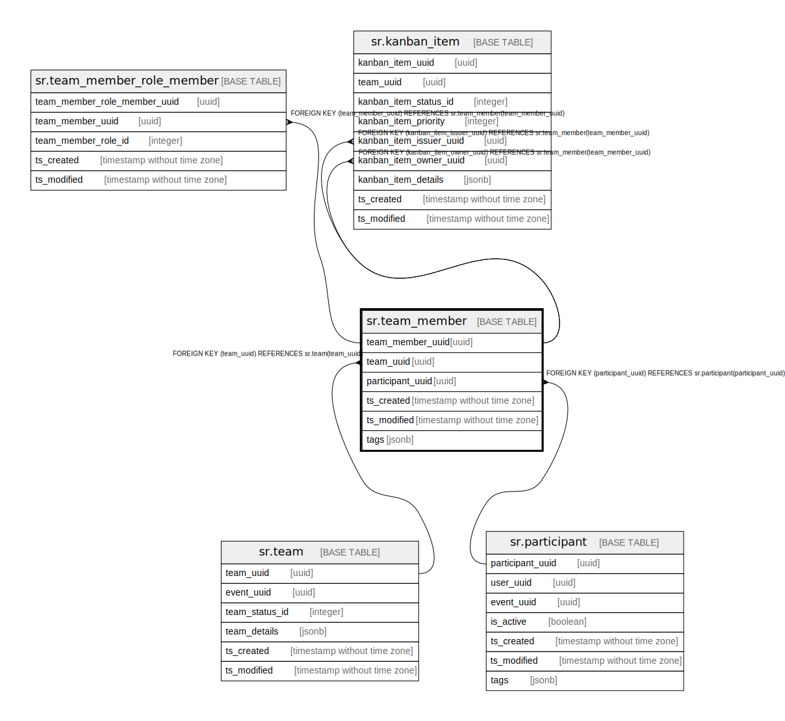

# sr.team_member

## Description

## Columns

| Name | Type | Default | Nullable | Children | Parents | Comment |
| ---- | ---- | ------- | -------- | -------- | ------- | ------- |
| team_member_uuid | uuid |  | false | [sr.team_member_role_member](sr.team_member_role_member.md) [sr.kanban_item](sr.kanban_item.md) |  |  |
| team_uuid | uuid |  | false |  | [sr.team](sr.team.md) |  |
| participant_uuid | uuid |  | false |  | [sr.participant](sr.participant.md) |  |
| ts_created | timestamp without time zone | (now() AT TIME ZONE 'utc'::text) | true |  |  |  |
| ts_modified | timestamp without time zone | (now() AT TIME ZONE 'utc'::text) | true |  |  |  |
| tags | jsonb |  | true |  |  |  |

## Constraints

| Name | Type | Definition |
| ---- | ---- | ---------- |
| fk_participant | FOREIGN KEY | FOREIGN KEY (participant_uuid) REFERENCES sr.participant(participant_uuid) |
| fk_team | FOREIGN KEY | FOREIGN KEY (team_uuid) REFERENCES sr.team(team_uuid) |
| team_member_pkey | PRIMARY KEY | PRIMARY KEY (team_member_uuid) |

## Indexes

| Name | Definition |
| ---- | ---------- |
| team_member_pkey | CREATE UNIQUE INDEX team_member_pkey ON sr.team_member USING btree (team_member_uuid) |

## Relations

---

> Generated by [tbls](https://github.com/k1LoW/tbls)
