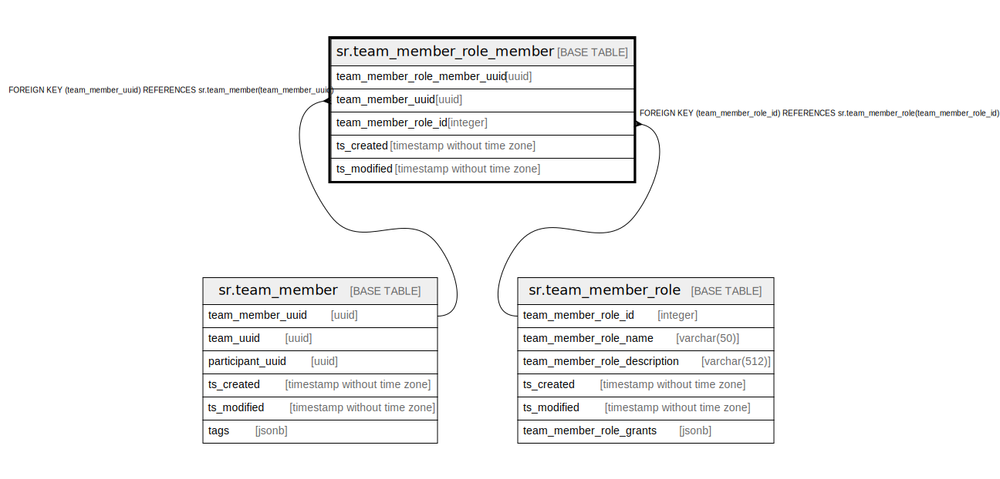

# sr.team_member_role_member

## Description

## Columns

| Name | Type | Default | Nullable | Children | Parents | Comment |
| ---- | ---- | ------- | -------- | -------- | ------- | ------- |
| team_member_role_member_uuid | uuid |  | false |  |  |  |
| team_member_uuid | uuid |  | false |  | [sr.team_member](sr.team_member.md) |  |
| team_member_role_id | integer | 1 | false |  | [sr.team_member_role](sr.team_member_role.md) |  |
| ts_created | timestamp without time zone | (now() AT TIME ZONE 'utc'::text) | true |  |  |  |
| ts_modified | timestamp without time zone | (now() AT TIME ZONE 'utc'::text) | true |  |  |  |

## Constraints

| Name | Type | Definition |
| ---- | ---- | ---------- |
| fk_team_member_uuid | FOREIGN KEY | FOREIGN KEY (team_member_uuid) REFERENCES sr.team_member(team_member_uuid) |
| fk_team_member_role_id | FOREIGN KEY | FOREIGN KEY (team_member_role_id) REFERENCES sr.team_member_role(team_member_role_id) |
| team_member_role_member_pkey | PRIMARY KEY | PRIMARY KEY (team_member_role_member_uuid) |

## Indexes

| Name | Definition |
| ---- | ---------- |
| team_member_role_member_pkey | CREATE UNIQUE INDEX team_member_role_member_pkey ON sr.team_member_role_member USING btree (team_member_role_member_uuid) |

## Relations

---

> Generated by [tbls](https://github.com/k1LoW/tbls)
