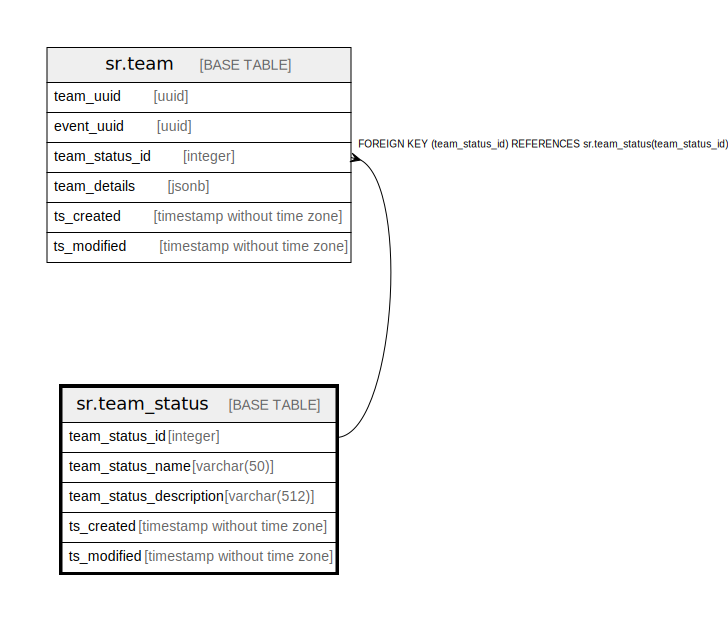

# sr.team_status

## Description

## Columns

| Name | Type | Default | Nullable | Children | Parents | Comment |
| ---- | ---- | ------- | -------- | -------- | ------- | ------- |
| team_status_id | integer |  | false | [sr.team](sr.team.md) |  |  |
| team_status_name | varchar(50) |  | false |  |  |  |
| team_status_description | varchar(512) |  | true |  |  |  |
| ts_created | timestamp without time zone | (now() AT TIME ZONE 'utc'::text) | true |  |  |  |
| ts_modified | timestamp without time zone | (now() AT TIME ZONE 'utc'::text) | true |  |  |  |

## Constraints

| Name | Type | Definition |
| ---- | ---- | ---------- |
| team_status_pkey | PRIMARY KEY | PRIMARY KEY (team_status_id) |

## Indexes

| Name | Definition |
| ---- | ---------- |
| team_status_pkey | CREATE UNIQUE INDEX team_status_pkey ON sr.team_status USING btree (team_status_id) |

## Relations

---

> Generated by [tbls](https://github.com/k1LoW/tbls)
