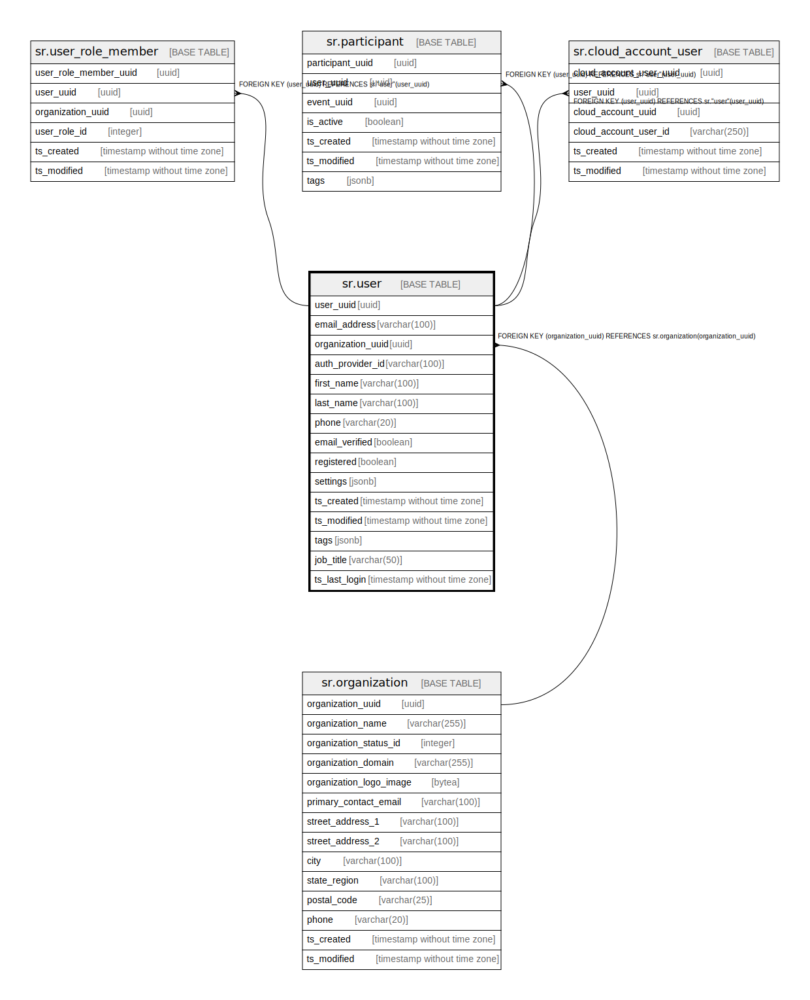

# sr.user

## Description

## Columns

| Name | Type | Default | Nullable | Children | Parents | Comment |
| ---- | ---- | ------- | -------- | -------- | ------- | ------- |
| user_uuid | uuid |  | false | [sr.user_role_member](sr.user_role_member.md) [sr.participant](sr.participant.md) [sr.cloud_account_user](sr.cloud_account_user.md) |  |  |
| email_address | varchar(100) |  | false |  |  |  |
| organization_uuid | uuid |  | true |  | [sr.organization](sr.organization.md) |  |
| auth_provider_id | varchar(100) |  | true |  |  |  |
| first_name | varchar(100) |  | true |  |  |  |
| last_name | varchar(100) |  | true |  |  |  |
| phone | varchar(20) |  | true |  |  |  |
| email_verified | boolean | false | false |  |  |  |
| registered | boolean | false | false |  |  |  |
| settings | jsonb |  | true |  |  |  |
| ts_created | timestamp without time zone | (now() AT TIME ZONE 'utc'::text) | true |  |  |  |
| ts_modified | timestamp without time zone | (now() AT TIME ZONE 'utc'::text) | true |  |  |  |
| tags | jsonb |  | true |  |  |  |
| job_title | varchar(50) |  | true |  |  |  |
| ts_last_login | timestamp without time zone | (now() AT TIME ZONE 'utc'::text) | true |  |  |  |

## Constraints

| Name | Type | Definition |
| ---- | ---- | ---------- |
| fk_organization | FOREIGN KEY | FOREIGN KEY (organization_uuid) REFERENCES sr.organization(organization_uuid) |
| user_pkey | PRIMARY KEY | PRIMARY KEY (user_uuid) |

## Indexes

| Name | Definition |
| ---- | ---------- |
| user_pkey | CREATE UNIQUE INDEX user_pkey ON sr."user" USING btree (user_uuid) |

## Relations

---

> Generated by [tbls](https://github.com/k1LoW/tbls)
