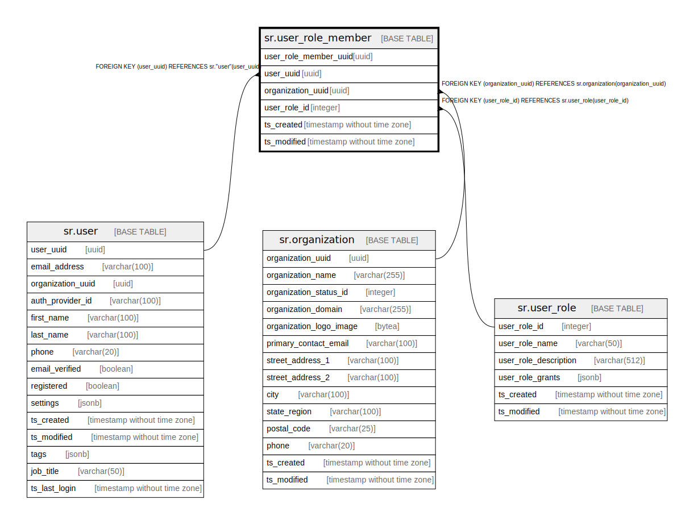

# sr.user_role_member

## Description

## Columns

| Name | Type | Default | Nullable | Children | Parents | Comment |
| ---- | ---- | ------- | -------- | -------- | ------- | ------- |
| user_role_member_uuid | uuid |  | false |  |  |  |
| user_uuid | uuid |  | false |  | [sr.user](sr.user.md) |  |
| organization_uuid | uuid |  | false |  | [sr.organization](sr.organization.md) |  |
| user_role_id | integer | 1 | false |  | [sr.user_role](sr.user_role.md) |  |
| ts_created | timestamp without time zone | (now() AT TIME ZONE 'utc'::text) | true |  |  |  |
| ts_modified | timestamp without time zone | (now() AT TIME ZONE 'utc'::text) | true |  |  |  |

## Constraints

| Name | Type | Definition |
| ---- | ---- | ---------- |
| fk_organization_uuid | FOREIGN KEY | FOREIGN KEY (organization_uuid) REFERENCES sr.organization(organization_uuid) |
| fk_user_uuid | FOREIGN KEY | FOREIGN KEY (user_uuid) REFERENCES sr."user"(user_uuid) |
| fk_user_role_id | FOREIGN KEY | FOREIGN KEY (user_role_id) REFERENCES sr.user_role(user_role_id) |
| user_role_member_pkey | PRIMARY KEY | PRIMARY KEY (user_role_member_uuid) |

## Indexes

| Name | Definition |
| ---- | ---------- |
| user_role_member_pkey | CREATE UNIQUE INDEX user_role_member_pkey ON sr.user_role_member USING btree (user_role_member_uuid) |

## Relations

---

> Generated by [tbls](https://github.com/k1LoW/tbls)
